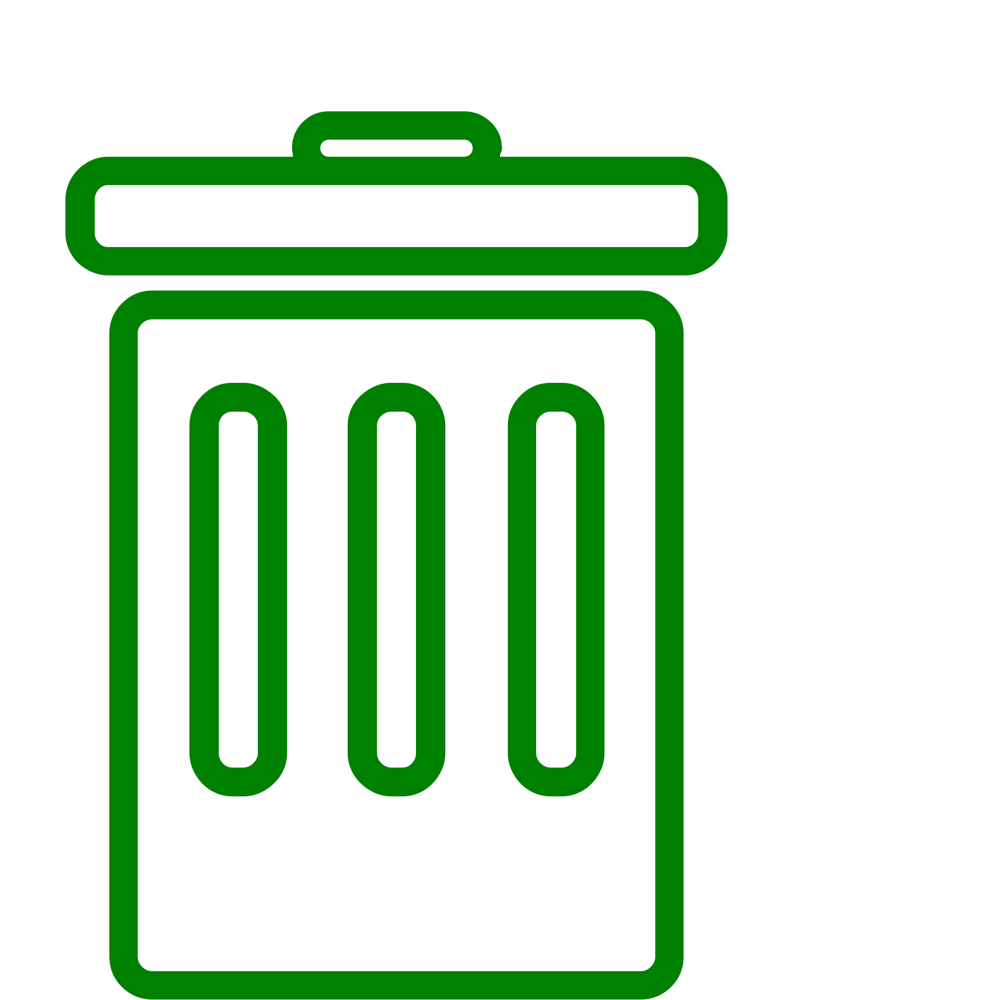
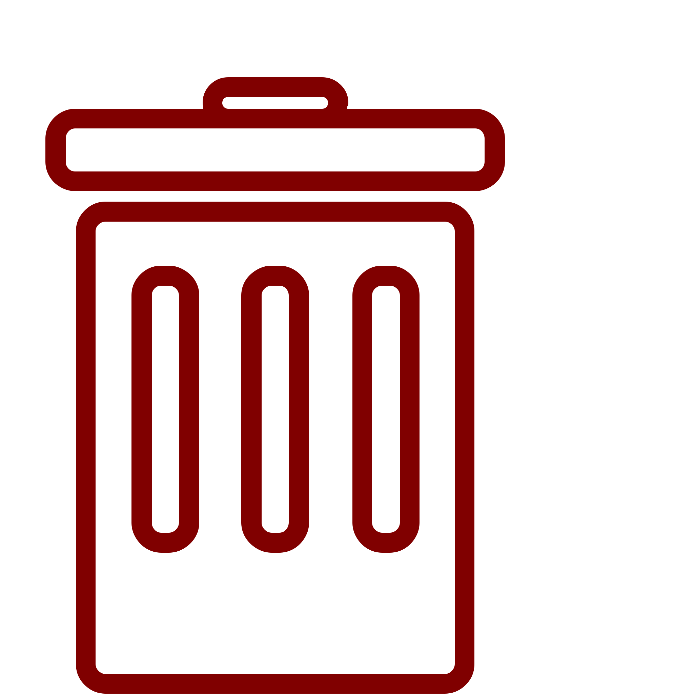
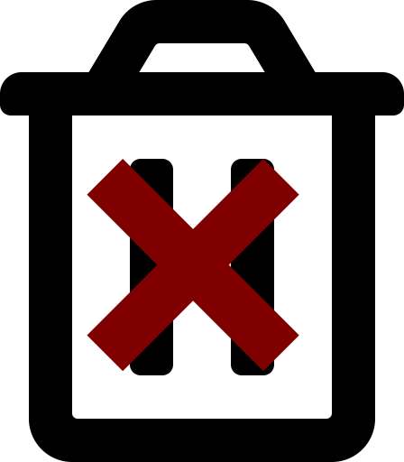

Ceci Sont Mes Icons (L'icone Poubelle Est De Chez Font Awesome) Qui Indique Le Niveau De Consequence En Cas De Suppression De Votre Publication, Que Ce Soit Sur GitHub Partout Même Sur YouTube

*  Indique Que Vous Pouvez Le Supprimé Il Ya Aucune Conséquances
*  Indique Que Votre Suppression Est + Ou Moin Génante
*  Indique Que Votre Contenu Est Important, Et Ne Doit Pas Etre Supprimé
*  Indique Que Votre Contenu Est Au Standard Est Qui Est Strictement Interdit De Le Supprimé
